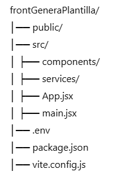
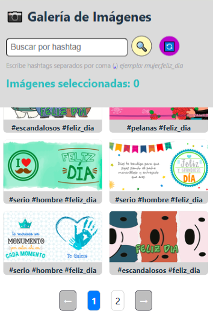
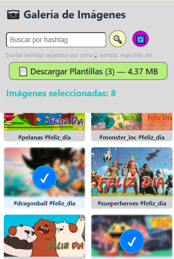
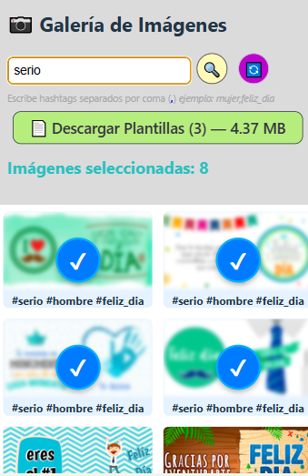
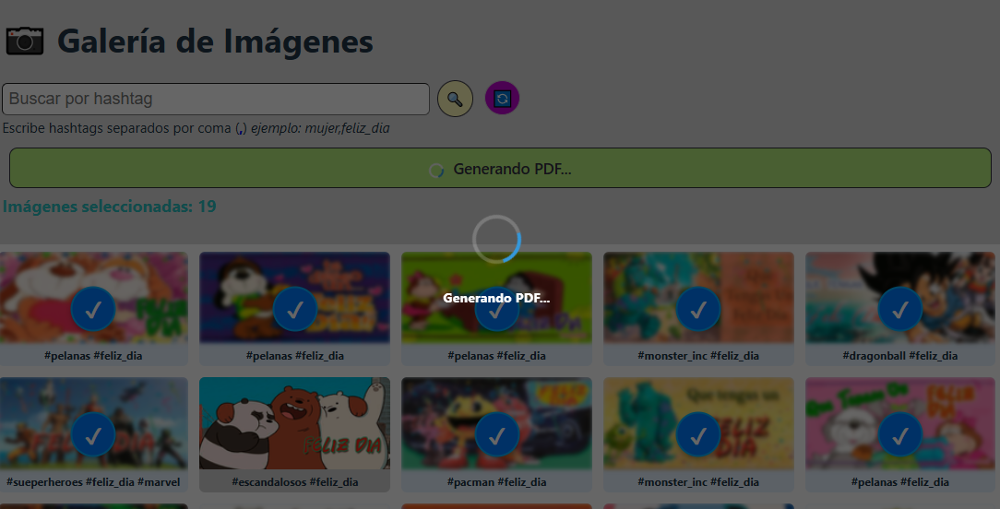
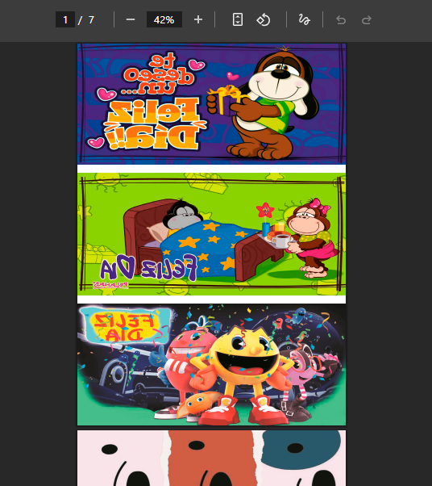

# 📷 Generador de Plantillas - Frontend

Aplicación frontend construida con **React + Vite**, desplegada en **Netlify**, que permite visualizar imágenes, filtrarlas por hashtags y generar plantillas en PDF.

---

## 🚀 Características
- 🔍 Búsqueda por hashtag
- 📦 Selección múltiple de imágenes
- 📄 Generación de PDFs con las imágenes seleccionadas
- 🎨 Responsive Design (mobile-first)
- ⚡ Desplegado en **Netlify**

---

## 📂 Estructura del proyecto

---

## ⚙️ Instalación local
1. Clonar el repositorio:
   git clone https://github.com/tuusuario/frontGeneraPlantilla.git
   cd frontGeneraPlantilla

2. Instalar dependencias:
    npm install

3. Configurar variables de entorno en .env:
    VITE_API_URL=https://back-tazas-generador.onrender.com

4. Levantar el servidor:
    npm run dev

👉 Abre http://localhost:5173

🌍 Despliegue en Netlify

Build Command: npm run build

Publish Directory: dist

Variables de entorno:

🌍 Despliegue en Netlify

Build Command: npm run build

Publish Directory: dist

Variables de entorno:

VITE_API_URL=https://back-tazas-generador.onrender.com

   

🛠️ Tecnologías utilizadas

React + Vite

JavaScript (ES6+)

CSS Grid + Media Queries

Netlify
